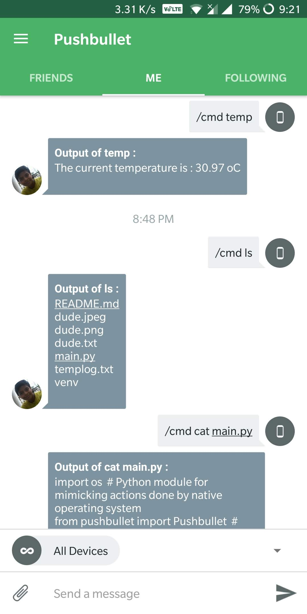
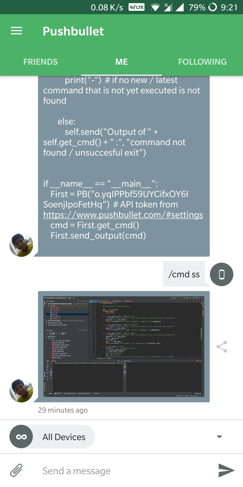
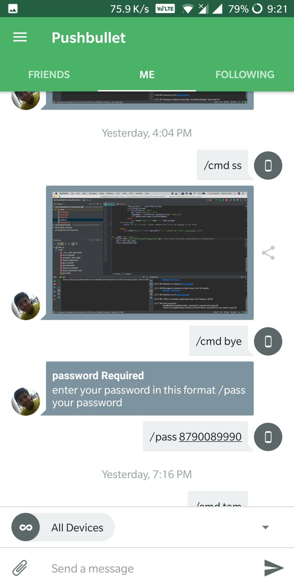

# TerminalController

There are times when we require to go to our terminal for small things, what if there is some kind of handshaking between
the phone and the terminal, seems amazing right!!! 

[](https://forthebadge.com) [](https://forthebadge.com)


## How to get API access token

1) Open the following [link](https://www.pushbullet.com/#settings/account).
2) Then click on `Create Access Token`.
3) Done! your token is generated.

## Installing the requirements

``` bash
pip install -r requirements.txt
```

## Current Functionality

* Execution of basic commands 
* Execution of commands which include super user privileges
* Shutdown, Restart
* Screen capture 

## Working Screen shots

>Basic Commands example:



>Screenshot Feature



>Execution of sudo commands



